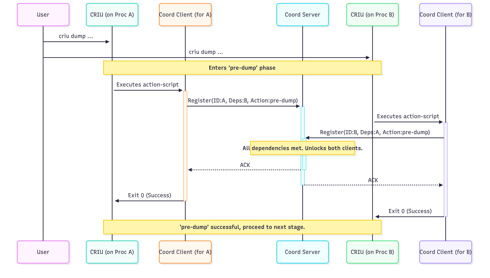

# GSoC 2025 final report

**Project**: [Coordinated checkpointing of distributed applications](https://summerofcode.withgoogle.com/programs/2025/projects/0zNfEhdN)

**Organisation**: [CRIU](https://criu.org)

**Mentors**: [Radostin Stoyanov](https://github.com/rst0git),  [Prajwal Nadig](https://github.com/snprajwal)

**Proposal**: [Coordinated checkpointing of distributed applications
](proposal.pdf)

# Introduction

This is the final report of my work during Google Summer of Code 2025 with [CRIU](https://criu.org) on the projet of Coordinated checkpointing of distributed applications.

[CRIU](https://criu.org) is the **Checkpoint/Restore In Userspace** project, which provides a way to checkpoint a running application and save its state to disk, allowing it to be restored later. In distributed environments, checkpointing and restoring multiple applications is challenging due to the need to coordinate the state of multiple applications potentially running on different nodes and with network connections.

[criu-coordinator](https://github.com/checkpoint-restore/criu-coordinator) is a tool for enabling coordinated checkpointing of distributed applications. It helps manage the checkpointing and restoration of multiple processes using CRIU `action-script` feature.

This project focused on enhancing [criu-coordinator](https://github.com/checkpoint-restore/criu-coordinator) to handle established TCP connections during the coordinated checkpoint and restore of distributed applications.

# Overview

[criu-coordinator](https://github.com/checkpoint-restore/criu-coordinator) operates on a client-server model to synchronize the checkpoint and restore lifecycle of multiple processes.

**criu-coordinator server**: A TCP server that acts as the central point of coordination. It maintains the state of every participating process, tracking its dependencies and its progress through the checkpoint/restore lifecycle.

**criu-coordinator client**: A command-line tool invoked by each CRIU instance as an action-script at different hooks of the dump and restore process (e.g., pre-dump, network-lock, pre-restore).

Below is a simplified diagram of the flow for a single hook between two processes named A and B:

 

# Work completed

The work accomplished during the GSoC period can be broken down into several key areas:

### 1. Implemented network hook synchronization

The primary objective of the project was to enable the coordinated checkpointing of applications with active TCP connections. This was achieved by extending `criu-coordinator` to handle CRIU's network-related action scripts.

*   **`network-lock` and `network-unlock` handlers**: I implemented the client and server logic to handle the `network-lock` hook during the dump phase and the `network-unlock` hook during the restore phase.
*   **Synchronization barriers**: The server now enforces synchronization barriers for these hooks. When a client reports `network-lock`, the server waits until all its declared dependencies have also reached the `network-lock` state before allowing any of them to proceed. This ensures that the network state is locked across all participating programs. A similar barrier is implemented for `network-unlock` to ensure connections are re-established in a coordinated manner.

### 2. Improved server coordination logic

Early in the project, the server's coordination logic needed to be more robust to handle concurrent client connections without deadlocks.

*   **Deadlock resolution**: I have refactored the server's state management and locking mechanisms to resolve deadlocks that occurred when multiple clients connected simultaneously.
*   **Efficient state synchronization**: The initial polling-based mechanism for waiting on dependencies was replaced with a more efficient implementation using the `Condvar` synchronization primitive.
*   **Clearer state tracking**: The server's internal state tracking was refined to explicitly track dump and restore operations separately.

### 3. Enhanced usability with global configuration support [OPEN PR]

To simplify the configuration for users, especially for containerized applications, where managing individual configuration files per container is not ideal, I have implemted support for a global configuration file.

*   **Dependencies grouping**: Instead of requiring a `criu-coordinator.json` file for each process, users can now define a single file at `/etc/criu/criu-coordinator.json`.
*   **Dynamic ID Detection**: The client logic was improved to automatically detect the process or container ID from the environment (e.g., by inspecting `/proc/<pid>/cgroup` for a container ID or using the process name). It then looks up its dependencies in the global configuration map. This simplifies the setup for checkpointing multiple containers, where a single configuration file can define the entire dependency graph and no need for configuration file during the restore phase because the configuration file for each container/process will be written to the checkpoint archive during the dump phase.

### 4. Developed a testing suite

To ensure that the features developed worked as espected, a significant portion of the project was dedicated to building a testing suite.

*   **Simple integration tests**: I   added integration tests for the core client-server coordination logic, allowing for rapid validation of the synchronization mechanism without needing a CRIU installation.

*   **E2E tests with CRIU**: A full E2E test suite was developed to validate the complete workflow with actual CRIU `dump` and `restore` operations on simple processes (with and without established TCP connections).
*   **E2E Tests with Podman Containers [DRAFT PR]**: To validate the solution in a realistic, containerized environment, I created an E2E test that checkpoints and restores two Podman containers (a TCP client and server) communicating over a dedicated container network. 

*   **CI**: All tests were integrated into the GitHub Actions CI workflow.

### Pull requests

Below is a list of the relevants pull requests during the GSoC period.

*   [Add global configuration file support](https://github.com/checkpoint-restore/criu-coordinator/pull/14)
*   [Enhance server coordinatioin](https://github.com/checkpoint-restore/criu-coordinator/pull/13)
*   [feat: add network hooks synchronization](https://github.com/checkpoint-restore/criu-coordinator/pull/11)
*   [test: add test for client/server coordination logic](https://github.com/checkpoint-restore/criu-coordinator/pull/9)
*   [Fix deadlock on checkpoint/restore coordination logic](https://github.com/checkpoint-restore/criu-coordinator/pull/7)
*   [ci: fix linting and ci workflow](https://github.com/checkpoint-restore/criu-coordinator/pull/3)

# Challenges

- Ensuring deadlock-free coordination: The server is responsible for managing the state of multiple clients, each progressing through various checkpoint/restore stages. The initial implementation was prone to deadlocks under concurrent client connections. Resolving this required miticulous reviewing and refactoring of the state management and locking mechanisms to ensure that the server could handle simultaneous requests without getting blocked.

- Setting up testing environments: Testing was challenging due to the need for orchestrating multiple processes, the coordinator server, and CRIU itself. Setting this up was challenging at times.

- Handling network-related challenges: The programs used for testing involved and simple TCP client and server. The server was designed to handle multiple incoming connections. The tests for simple processes  worked out fine and was consistent. However, when testing with containerized versions of the TCP client and server, inconsistencies were observed. This was due to the additional layers of networking and isolation introduced by containerization, which affected how TCP connections of child processes were handled. This issue wasn't yet being resolved during the GSoC period, but I plan to continue working on it. The current workaround is to simplify the server to handle a single connection at a time.

# Future work

While this project established the foundation for network-aware coordinated checkpointing, there is still a lot of work remaining. Some ideas for future work:

- Kubernetes integration: The current work was validated with Podman containers, which provides a good proof-of-concept for Kubernetes environments. However, further work is needed to ensure integration with Kubernetes, especially when handling pods networking.

- User experience enhancements: The current implementation requires users to manually set up and manage the coordinator server and the clients dependency graph. Future work could focus on automating this process, making it easier for users to use criu-coordinator.

# Acknowledgments

I am really grateful for having the opportunity to participate in GSoC for the second time with CRIU. I would like to thank my mentors [Radostin Stoyanov](https://github.com/rst0git) and  [Prajwal Nadig](https://github.com/snprajwal) for their guidance, reviews, and support during the project. 

# Resources

- [CRIU](https://criu.org)
- [criu-coordinator](https://github.com/checkpoint-restore/criu-coordinator)
- [Google Summer of Code Ideas - Coordinated checkpointing of distributed applications](https://criu.org/Google_Summer_of_Code_Ideas#Coordinated_checkpointing_of_distributed_applications)
